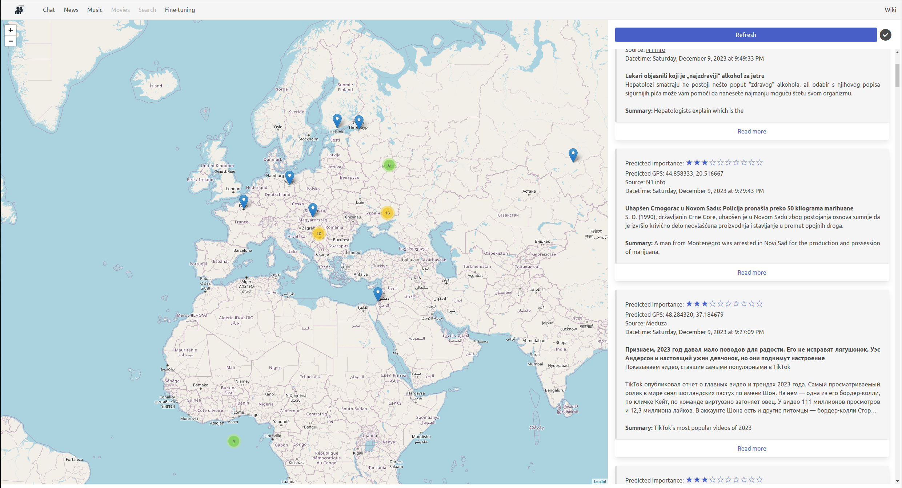
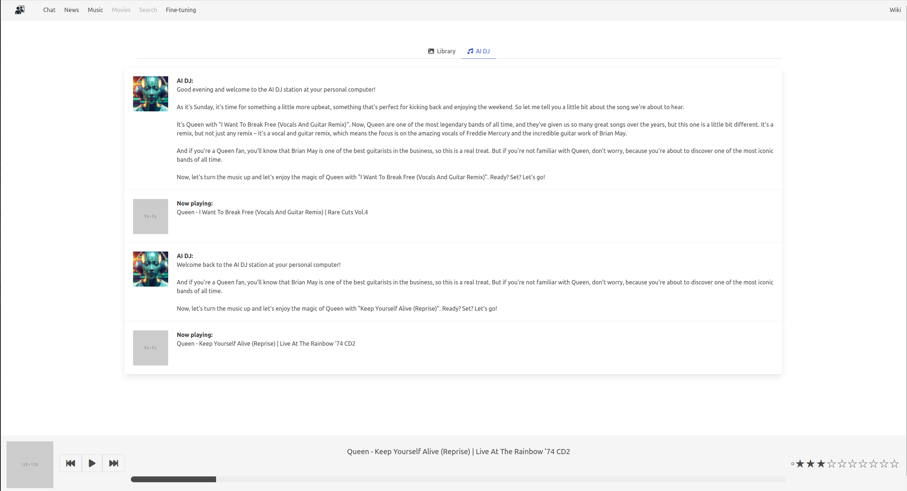

# Anagnorisis
Anagnorisis - is a local recommendation system based on Llama 2 that is fine-tuned on your data to predict importance of the news, music and movie preferences. You can feed it as much of your personal data as you like and not be afraid of it leaking as all of it is stored and processed locally on your own computer. You can also chat with the fine-tuned model directly to see how well it is remembering important information and how well it is aligned with your preferences. Or as Westworld put it, test the '[fidelity](https://www.youtube.com/watch?v=h9dPyubQ4MU)'. 

The project uses [llama2_7b_chat_uncensored](https://huggingface.co/georgesung/llama2_7b_chat_uncensored) as a base model as it provides cheap and reliable way to get expected results before any fine-tuning. It uses [Flask]() libraries for backend, [Huggingface]() libraries for all ML related stuff and [Bulma]() as frontend CSS framework. This is the main technological stack, however there are more libraries used for specific purposes.

While developing the aim is to keep everything working under the 8GB of VRAM, however this limit might be changed in the future. Please be aware that proper functionality with less amount of VRAM is not guaranteed. The project is at its very early stage so expect to have many bugs and difficulties running it on your PC.

| [](static/screenshot_1.png) | [](static/screenshot_2.png) |
|:-------------------------------------------------------------------:|:-------------------------------------------------------------------:|
| News page screenshot                                                | Music page screenshot                                               |

## Installation
The project has only been tested on Ubuntu 22.04, there is no guarantee that it will work on any other platform. It is just a personal project, so there are no plans to add any support for other OS for now.  

Recreate the Environment with following commands:  
```
python3 -m venv .env  # recreate the virtual environment  
source .env/bin/activate  # activate the virtual environment  
pip install -r requirements.txt  # install the required packages  
```  

Initialize your database with this command:  
```
flask --app flaskr init-db
```  
This should create a new 'instance/project.db' file, that will store your preferences, that will be used later to fine-tune the model.  

Then run the project with command:  
```
bash run.sh
```

The project should be up and running on http://127.0.0.1:5001/  
To change your media folder go to 'config,yaml' file and change 'music_page.media_directory' param to path of your music folder.  


## General
Here is the main pipeline of working with the project:  
1. You rate some data such as news, songs, movies or anything else on the scale from 0 to 10 and all of this is stored in the project database.  
2. When you acquire some amount of such rated data points you go to the 'fine-tuning' page and start the fine-tuning of the model so it could rate the data AS IF it was rated by you.  
3. New model is used to sort new data by rates from the model and if you do not agree with the scores the model gave, you simply change it and store in the database.  

You repeat these steps again and again, getting each time model that better and better aligns to your preferences.  

## News
// TODO

Empirically I could say that you would need to have a minimum of one hundred rated news before the model would start to pick up your preferences. 

## Music

Right now LLM based music recommendation engine at prototyping stage, however there is very simple recommendation engine implemented based on the user's scores of the music.

### Radio mode

While playing music there is 'Radio mode' available, activating it will add your own LLM driven DJ that will speak something about your music before playing it. To make it more reliable and minimize hallucinations, provide a good amount of information about your music and your favorite bands into the memory of the system and do not forget to fine-tune it afterwards.

## Movies

This feature at the prototyping stage.

## Search

This feature at the prototyping stage.

## Fine-tuning
There are several different datasets used for fine-tuning. 

[Open Assistant Best Replies](https://huggingface.co/datasets/timdettmers/openassistant-guanaco) dataset from is used to keep the model capable of basic human-assistant conversation and mostly prevents the model from degrading out of assistant regime.

News dataset is an automatically generated one, that makes the model understand your preferable way of rating importance of the news and improves its GPS and summary prediction capability.

Memory data is different from all other types of data in a way that while fine-tuning the evaluation data is just a subset of training data. In contrast for all other types, training and evaluation data are always different. 

You can also enable "self-aware" mode at the fine-tuning stage. This will add all source files of the project into the model's training data. This mode is mostly intended for the development of the project. 

## Wiki

The project has its own wiki that is integrated into the project itself, you might access it by running the project, or simply reading it as markdown files.

Here is some pages that might be interesting for you:  
[Change history](wiki/change_history.md)


---------------	

In memory of [Josh Greenberg](https://variety.com/2015/digital/news/grooveshark-josh-greenberg-dead-1201544107/) - one of the creators of Grooveshark. Long gone music service that had the best music recommendation system I've ever seen. 
